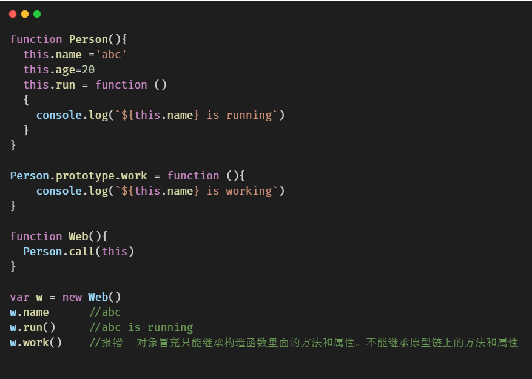
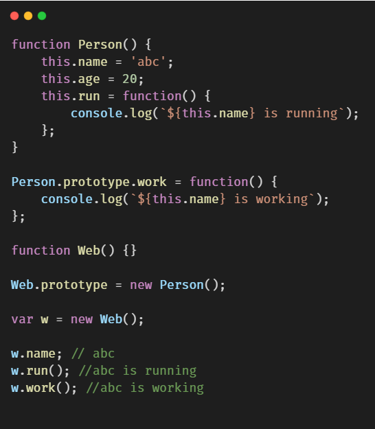
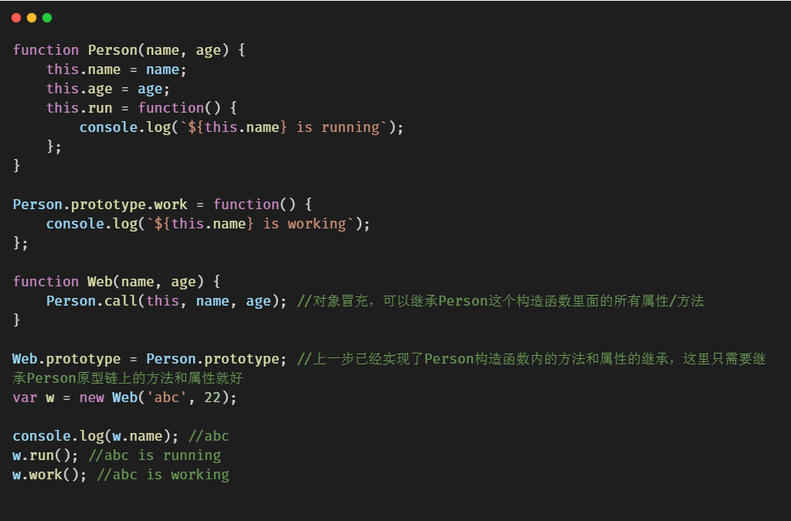

# 继承

##### 对象冒充的方式实现继承
弊端：只能继承构造函数里面的属性/方法。原型链上的无法继承 

##### 原型链的方式实现继承
弊端：实例化子类的时候，无法给父类传参 
 
 

##### 原型链+对象冒充实现继承
推荐方法一。因为如果子类的原型链中，有自己的方法时候，<code>Web.prototype = Person.prototype</code>会导致父类（Person）中也会有子类的方法。因为js中，对象是引用类型。如果简单的把一个对象赋值给另外一个对象，实际上，这两个对象指向的都是同一个地址。修改其一，两者跟着改变。
方法一： 
 
方法二： 
 