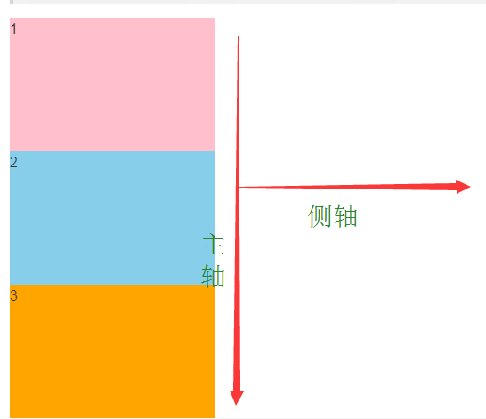

# `flex`布局

##### 作用
简便，响应式的实现各种页面布局。

##### 常用属性
- `display:flex` 定义一个`flex`布局
- `flex-direction` 设置项目的排列方式，分为`row`和`column`
- `justify-content` 设置项目在主轴上的对齐方式，分为`flex-end`,`flex-start`,`space-around`,`space-between`,`center`
- `align-items` 设置项目在侧轴上的对齐方式，属性值`flex-start`,`flex-end`,`center`,`baseline`,`stretch`;

##### 案例
> `flex-direction有两个属性`。 `row`：设置横向排列，`column`：设置纵向排列。如下，设置了`flex-direction:column`,所以主轴为垂直方向，侧轴为水平方向

<div class="flex-wrapper">
  <div style="background:pink">1</div>
  <div style="background:skyblue">2</div>
  <div style="background:orange">3</div>
</div>

<style>
.flex-wrapper{
  width:750px;
  display:flex;
  flex-direction:column;
}
.flex-wrapper div{
  width:230px;
  height:150px;
}
</style>



```html
<div class="flex-wrapper">
  <div style="background:pink">1</div>
  <div style="background:skyblue">2</div>
  <div style="background:orange">3</div>
</div>

<style>
.flex-wrapper{
  width:750px;
  display:flex;
  flex-direction:column;
}
.flex-wrapper div{
  width:230px;
  height:150px;
}
</style>
```

> `justify-content`设置项目在主轴上的对齐方式，`align-items`用来设置项目在侧轴上的对齐方式,。现在试试来设置内容水平垂直居中以及右对齐

<div class="flex-wrapper-2">
  <div style="background:pink">1</div>
  <div style="background:skyblue">2</div>
  <div style="background:orange">3</div>
</div>

<style>
.flex-wrapper-2{
  width:750px;
  display:flex;
  flex-direction:column;
  align-items:flex-end;
}
.flex-wrapper-2 div{
  width:230px;
  height:150px;
  display:flex;
  justify-content:center;
  align-items:center;
}
</style>

```html
<div class="flex-wrapper">
  <div style="background:pink">1</div>
  <div style="background:skyblue">2</div>
  <div style="background:orange">3</div>
</div>

<style>
.flex-wrapper{
  width:750px;
  display:flex;
  flex-direction:column;
  align-items:flex-end;
}
.flex-wrapper div{
  width:230px;
  height:150px;
  display:flex;
  justify-content:center;
  align-items:center;
}
</style>
```