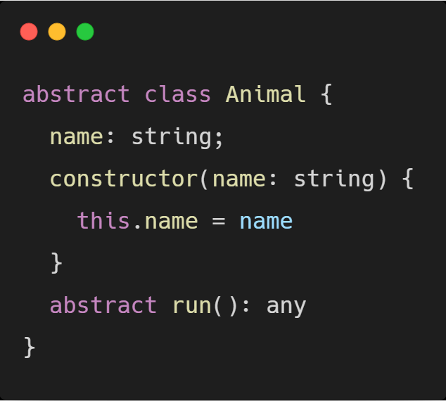
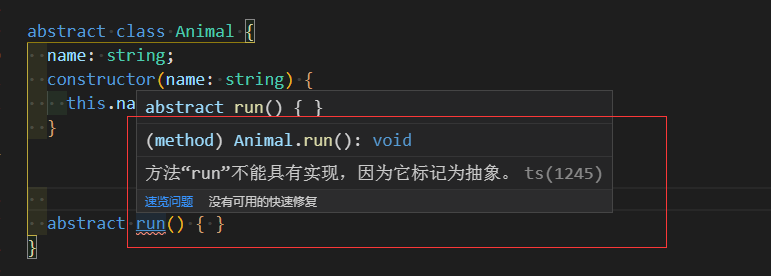
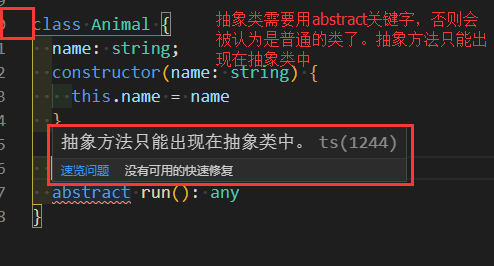
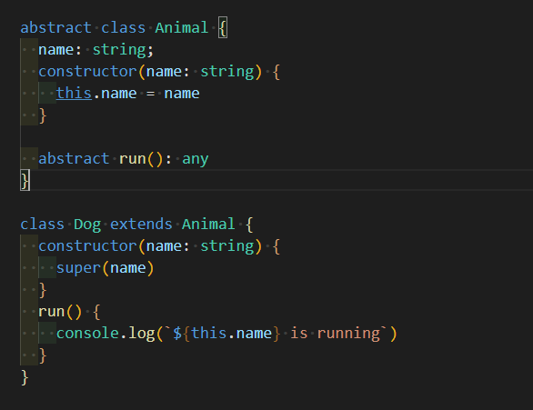

# 抽象类

##### 目的
用来定义标准，让子类都遵循此标准

##### 什么是抽象类
它提供了其它类继承的基类，不能被直接实例化。用abstract关键字定义抽象类和抽象方法。抽象类中的抽象方法不包含具体的实现，并且必须在派生类中实现。抽象方法，只能放在抽象类中。

##### 示例
1. 定义抽象类和抽象方法 

2. 抽象方法不能有具体的实现 

3. 抽象方法只能放在抽象类中 

4. 抽象类不能被实例化 

5. 抽象类的子类必须实现抽象类中的抽象方法 

