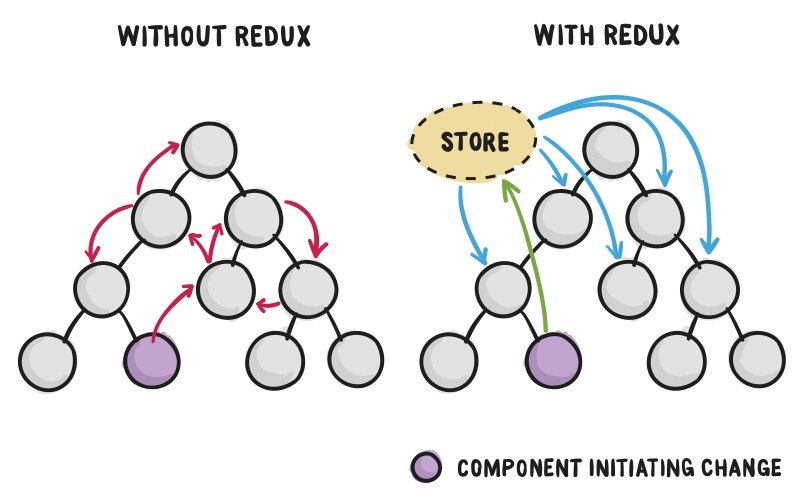
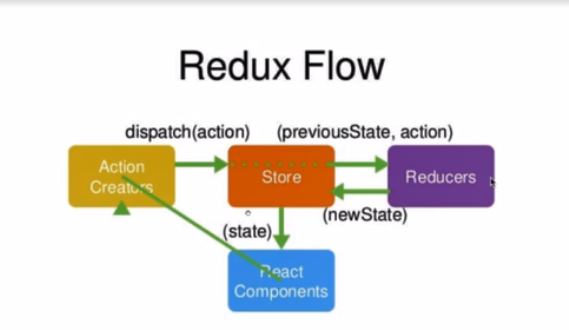
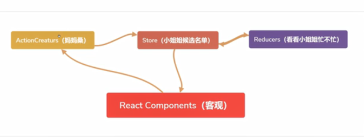
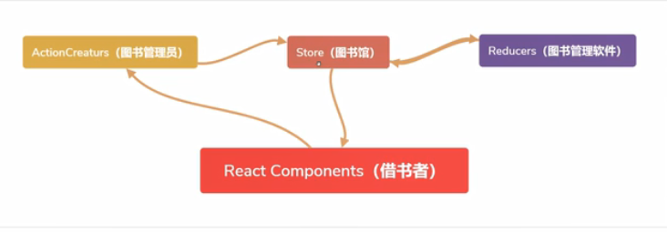
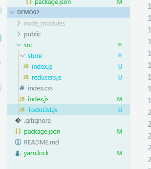

# Redux
##### 用途
`Redux`是一个用来管理数据状态和`UI`状态的`JavaScript`应用工具。随着`JavaScript`单页面应用（`SPA`）开发日趋复杂，`JavaScript`需要管理比任何时候都要多的`State`（状态），`Redux`就是降低管理难度。（`Redux`支持`React`，`Angular`，`JQuery`甚至纯`JavaScript`）

##### 优点

如图所示，每个圆圈代表一个组件。紫色组件的`state`发生变化的时候，左侧中，`state`是需要一级一级的传递的。而右侧，所有的组件都能从`store`中获取到`state`，组件之间的信息传递不比直接在彼此间进行，所有的`state`的变化都是通过`store`这个唯一数据源。

##### Redux的工作流程
图一：<br>
<br>
图一看起来特别的蒙圈是吗，没关系，先看图二吧。<br>

图二：<br>
<br>
用有爱的服务解释一下：把`React Components`看做一个客官。去舞厅找小姐姐的时候，首先会去找妈妈桑（`ActionCreaturs`），告诉他你要找xxx小姐。妈妈桑去舞厅（`store`）看看，没有找到你需要的小姐姐，然后会去叫主管（`Reducers`）找小姐姐，找到小姐姐后，把她带到舞厅（`store`）去。然后你就可以在舞厅找到你需要的小姐姐了。<br>

图三：<br>
<br>
换个角度再解释一下：<br>
`React Componets`看成一个借书者。先去管理员（`ActionCreaturs`）询问是否有xxx这本书，图书馆管理员（`ActionCreaturs`）去图书馆（`store`）里面没有找到，就去软件（`reducers`）上查询一下。得到的结果，是在图书馆（`store`）的xxx地方。然后就可以找到你需要的那本书了。<br>

图四：<br>
<br>
目录结构

##### 用法
简单来说，三步走
* 创建`store`
* 创建`reducer`，并注入到`store`中
* 业务组件中获取`store`的值

######  创建store
1. 安装Redux
	<code> npm i Redux --save-dev </code>

2. 项目目录下新建store文件夹，包含index.js（创建仓库）和reducer.js（返回state）
	```js
	// index.js
	import {createStore} from 'redux'
	const store = createStore()
	export default store
	```
	
	```js
	// reducer.js
	const defaultStore = {
		inputValue:'请输入内容',
		list:[]
	}
	export default(state=defaultStore,action) => {
		return state
	}
	```
3. 业务组件中获取store
	```
	import React, { Component, Fragment } from 'react';
	import { Input, Button, Row, Col, List } from 'antd';
	import 'antd/dist/antd.css';
	import store from './store';
	
	const styleObj = {
		margin: '20px auto',
		width: 500
	};
	
	const styleObjNext = {
		width: 300,
		marginTop: 10
	};
	
	const styleWidth = {
		width: 300
	};
	
	class TodoList extends Component {
		constructor(props) {
			super(props);
			const { inputValue, list } = store.getState();
			this.state = {
				inputValue,
				list
			};
		}
		render() {
			const { inputValue, list } = this.state;
			return (
				<Fragment>
					<div style={styleObj}>
						<Row>
							<Col span={15}>
								<Input placeholder={inputValue} style={styleWidth} />
							</Col>
							<Col span={4}>
								<Button type="primary">添加</Button>
							</Col>
						</Row>
						<List
							style={styleObjNext}
							bordered
							dataSource={list}
							renderItem={(item) => <List.Item>{item}</List.Item>}
						/>
					</div>
				</Fragment>
			);
		}
	}
	
	export default TodoList;
	```